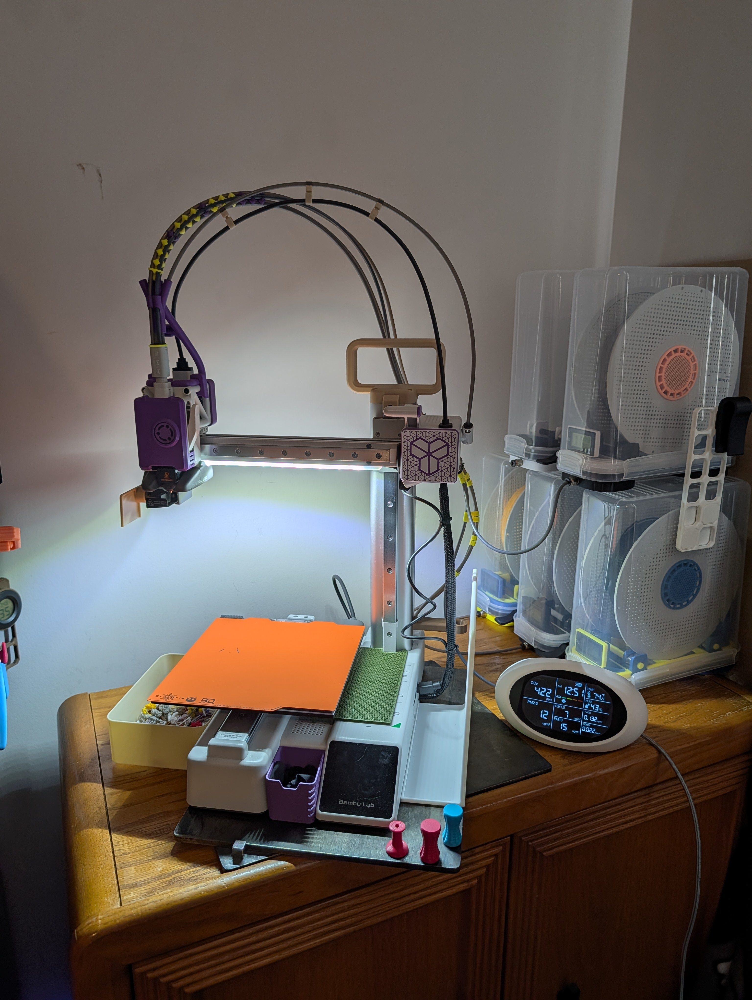

# A1 Mini: Optimized Start Routine

*A quieter, faster, and cleaner A1 Mini start routine built for repeatable daily use.*

#### ⚠️ Critical Safety Note

This script replaces your machine's default start G-code. Always save your original profile, review the script's logic, and remain near your printer during the first test print.

## Why use this?

The stock Bambu start routine is effective but can be noisy, repetitive, and occasionally leaves residue that affects bed leveling. This project optimizes the startup process, minimizing redundant moves and staging temperatures for a faster start to the first layer.

## Testing Status & Community Validation

This routine was developed and tested exclusively on my **A1 Mini**.

While I want to expand support to other Bambu machines over time, I currently do not have the machines to verify safety and timing on those platforms.

## Installation
1. Open **Bambu Studio**.
2. Open your **A1 Mini printer profile**.
3. Find the **Machine start G-code** section.
4. Replace the existing code with the contents of `machine-start.gcode`.
5. Save the profile under a new name (e.g., `A1 Mini 0.4 Optimized`).
6. Run a careful first test print and stay near the printer during startup!

## Technical Highlights
* **Guarded Axis Recovery**: Uses `G380` guarded Z-moves during early recovery so motion stops on resistance instead of forcing a collision.
* **Targeted Cleaning Sequence**: Introduces a 170°C "knock" sequence to mechanically break stubborn filament remnants, followed by a dual-offset rubber brush pass to clean the nozzle before ABL. This provides a cleaner nozzle for more accurate calibration results.
* **Reduced Startup Noise**: Suppresses the noisy per-print vibration compensation `M970.3` in favor of periodic manual tuning. This significantly reduces startup noise and decreases variability between prints.
* **Enhanced Readability**: The script has been reorganized with a clearer structure and more descriptive comments, making it easy to audit, modify, and maintain.
* **Motion Tuning**: Accelerations and movement transitions were refined to keep the routine fast and quiet without jostling the printer unnecessarily.

## Maintenance & Calibration
To maintain the performance of the printer:
* **Manual Vibration Calibration**: Since this script disables per-print calibration, you should occasionally run a manual calibration from the printer's menu, especially after moving the machine or changing the table surface.
* **Build Plate Detection**: Optional build plate detection support is retained, with the startup flow arranged to keep nozzle positioning safer during that stage.

## Audible Nozzle Indicators
The script includes custom `M1006` tones. You can use these to differentiate between nozzle sizes. For instance, use a "high-pitched" start for 0.2mm and a "low-pitched" start for 0.6mm.

**To Customize**:
1. Browse `tone-options.gcode` and find a tone to test.
2. In `machine-start.gcode`, find the `start printer sound` block (near line 25).
3. Replace the section from `M17` to `M18` with your chosen tone snippet.

## Previewing Tones (G-code Player)
If you want to hear these custom tones before committing them to your machine, I've included a lean, web-based preview tool. This helped me dial in the timing and pitches quickly, and I hope it helps you too.

**How to use:**
1. Locate `g-code-player.html` in this folder.
2. Open it in any web browser.
3. Choose a preset or paste your own `M1006` G-code to test it.

## Included Files
* `machine-start.gcode`: The master optimized start routine.
* `machine-start-default.gcode`: Stock reference for easy comparison or rollback.
* `machine-start-1.3.4.gcode`: Earlier public version for legacy reference.
* `tone-options.gcode`: A library of custom startup melodies.
* `g-code-player.html`: A web-based tool to preview and test `M1006` tones.

## Change-Filament & Manual Multi-Material
I am also developing a `change-filament.gcode` workflow for an MMS-style manual filament changing system. The goal is to make manual color swaps work with any number of filaments by stopping at the change, cutting filament, prompting for the next color, and completing the load routine automatically. This is currently in the testing phase to ensure 100% reliability, but early testing has been very promising and makes manual multi-color printing much more practical without an AMS.

